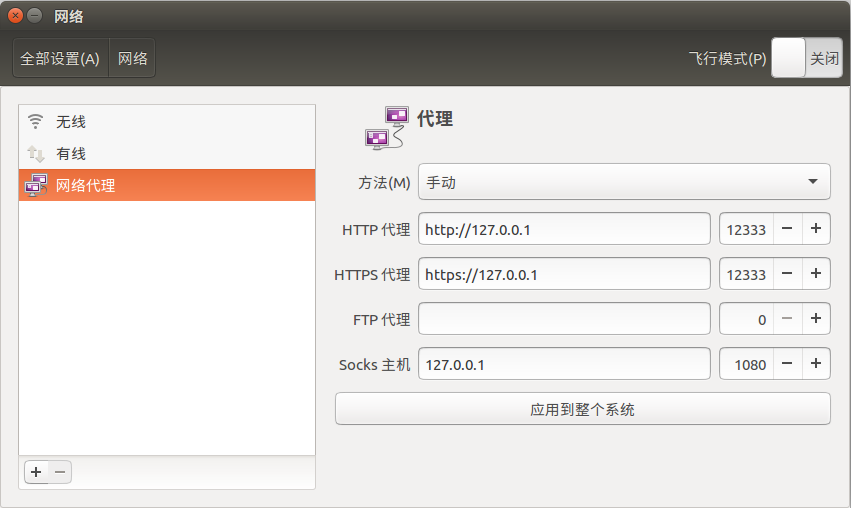

# Ubuntu使用代理
文章转载自[electron-ssr](https://www.jianshu.com/p/fba8637da1e3)：

>主要介绍Debian版本安装，这里主要介绍的是在Ubuntu下SSR工具的使用，具体服务器搭建或者购买这里不介绍。

>该项目在19年五月关闭，且行且珍惜，以下为作者关闭告别：
>Say goodbye to yesterday.
>Say hello to tomorrow.
>Remember you can be better.
>Be yourself and do yourself.
>Year by year, day by day.
>Enhance yourself to meet challenges.

客户端下载地址：[electron-ssr](https://github.com/qingshuisiyuan/electron-ssr-backup/releases/download/v0.2.6/electron-ssr-0.2.6.deb)

安装依赖：
```
sudo apt install libcanberra-gtk-module libcanberra-gtk3-module gconf2 gconf-service libappindicator1
```

可选依赖（如果软件报错，请安装可选依赖）：
```
sudo apt-get install libssl-dev 
sudo apt-get install libsodium-dev
```

开始安装：
```
cd Download
sudo dpkg -i *.deb
```

运行软件：
```
electron-ssr
```

系统运行需要python2.7，如果没有，请安装：
```
sudo apt install python
```

该软件支持订阅，订阅管理添加订阅地址（想办法搞一个）：
 

若不能成功代理，则在系统设置-网络-网络代理中选择手动（manual），如图设置（只根据ssr修改端口号）：


此时浏览器应该可以上外网，但终端应该ping不通google.com，也无法顺利执行`rosdep update`等命令，这是因为终端需要额外设置才能走代理。

执行命令：
```
export http_proxy=http://127.0.0.1:12333 
export https_proxy=https://127.0.0.1:12333
```
即可设置终端走代理。

同理可以设置alias，简化指令：

```
alias setproxy="export http_proxy=http://127.0.0.1:12333 
export https_proxy=https://127.0.0.1:12333" 
alias unsetproxy="unset ALL_PROXY"
```
