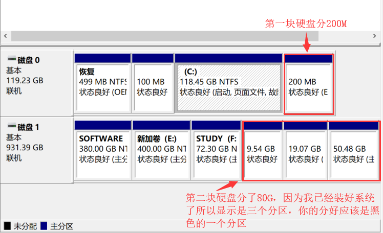

# Ubuntu双系统安装
由于虚拟机装ubuntu会遇到无法安装cuda的问题，所以索性放弃虚拟机，直接装了双系统。

转载自[Windows10安装ubuntu16.04双系统教程](https://www.cnblogs.com/masbay/p/10745170.html)（aubo驱动是为ubuntu16开发的，不过ubuntu16和18的安装没有区别，教程同样适用）：
## 一、查看电脑的信息
### 1.查看BIOS模式
"win+r"快捷键进入"运行"，输入"msinfo32"回车，出现以下界面，可查看BIOS模式：

**UEFI模式：**

**传统MBR模式：**

BIOS模式有传统的MBR模式和新式UEFI模式，这将对安装双系统的方法产生直接影响。目前来看，大部分电脑都属于新式UEFI模式，不过也存在一些老机子仍然属于传统MBR模式。本教程只介绍新式UEFI模式下的双系统安装方法，如果你的电脑属于传统MBR模式，强烈建议你重装windows系统来更新BIOS模式到UEFI。

### 2.搞清楚电脑的硬盘数

电脑是单双硬盘希望你买电脑时就已经清楚，这也算是卖点之一，如果这个都不知道，也请不要自暴自弃，继续往下看。

"此电脑"点击右键，点击"管理"，点击"磁盘管理"：

 

相信你已经清楚了自己电脑的信息，以下请注意有区分"单硬盘"和"双硬盘"操作的部分。

## 二、制作系统盘

需要准备以下工具：

①ubuntu系统镜像

②刻录软件，推荐"软碟通"，会提示注册，选择继续试用就好

③一个大于 2G 的 U 盘

### 1.安装并打开软碟通
插上 U 盘，并且最好备份你的 U 盘，因为之后需要格式化。

### 2.进入软碟通
选择文件，浏览到你的ubuntu镜像所在的目录，选择ubuntu镜像文件，双击打开，如图：

### 3.写入硬盘映像
在软碟通界面菜单栏选择"启动"，选择"写入硬盘映像"，如图所示：

 

接下来很重要，注意次序：

1）看你的硬盘驱动器是否对应的是你的 U 盘（必须是） ，一般默认是；

2）看映像文件是否对应你的 ubuntu 镜像；

3）如果上述均没有错误，选择格式化，之后就会格式化你的 U 盘；

4）在 U 盘格式化完毕之后，选择写入，之后就是慢慢等待了，等待写入完毕；

5）步骤二完毕。

## 三、在windows下创建空白分区

说明：这一步是为ubuntu系统分配空间，单硬盘和双硬盘存在一点区别。

### 1.划分磁盘
"此电脑"点击右键，点击"管理"，点击"磁盘管理"：

 

### 2.为ubuntu分配空间

（1）如果是单硬盘，选择最后一个盘（比如 CD两个盘的最后一个是D盘，CDE盘的最后一个是E盘，CDEF盘的最后一个是F盘，以此类推），在该盘点击右键，选择压缩卷，如下，输入压缩空间量，单位为M,如果空间充足，建议分出80G或100G，空间不足也可以分60G（1G=1024M）：

如果你的最后一个盘容量太小，还不够分出60G，那需要从其他盘匀一些过来，你需要用到DiskGenius这个工具，具体操作不在此介绍，希望你自行解决。

（2）如果是双硬盘，需要先在C盘（按理来说就是电脑的第一块硬盘，部分电脑系统装得比较奇怪，装到了第二块硬盘）分出200M的空白分区用来安装ubuntu的启动项（有少数朋友反馈分配200M安装过程中出现了空间不足的问题，如果空间足够，可以分500M），然后再在另一块硬盘选择最后一个盘（比如 CD两个盘的最后一个是D盘，CDE盘的最后一个是E盘，CDEF盘的最后一个是F盘，以此类推），在该盘点击右键，选择压缩卷，如下，输入压缩空间量，单位为M,如果空间充足，建议分出80G或100G，空间不足也可以分60G（1G=1024M）：

这里解释两个问题：

（1）单双硬盘为什么分区存在区别：你可以看到分区的差别只是双硬盘的时候在C盘分出了200M用来安装启动项。电脑在开机的时候，会自动在C盘所在的那个硬盘搜索启动项以启动系统，我们当然希望安装的ubuntu启动项也能够被搜索到，所以需要将启动项安装在这里，这样开机时会搜索到windows和ubuntu两个启动项，我们可以手动选择进入哪个系统。当然这里的"启动项需要安装在C盘所在的硬盘"并不是绝对的，只是为了开机能够自动搜索到启动项，安装在其他硬盘也可以，只是每次开机都需要进boot manager才能找到ubuntu启动项，比较麻烦，所以建议按照我的方法来分区。

（2）为什么要选择最后一个盘压缩卷：windows和ubuntu的文件存储格式是不一样的，我们分区的操作只是将磁盘分了一部分给ubuntu，事实上两个系统还是在共用一块磁盘，为了防止存储格式不同两个系统可能相互影响，我们通过从最后一个盘压缩将ubuntu的分区分到了磁盘最后一段，也就是一块磁盘的前部分是windows的分区，后部分是ubuntu的分区。

我的电脑是双硬盘，下面是我的分区结果：

## 四、用做好的系统盘安装系统

注：因为各个厂商的计算机bios和boot manager启动的快捷键不相同，所以请自行百度如何进bios和boot manager（也可能已经在开机界面写明，注意观察）。

### 1.U盘启动
插好系统盘，重启电脑，开机进bios，在Security页面，关掉secure boot（不同电脑secure boot可能在不同位置），然后到Boot页面，如果有Fast Boot这一项（部分联想电脑有），也把它关掉，没有忽略；然后保存更改，在Boot页面下方启动项选择 USB启动，回车，如果顺利进入安装页面，继续往下做；如果点击USB启动项无法进入，保存并退出，电脑会重启，根据自己电脑按相应的键进boot manager，找到USB启动项，回车即可进入。 

### 2.开始安装
然后会进入这个界面，选择Install Ubuntu，回车确认

 

### 3.语言设置
或许没有上一个界面，但是下面的界面一定是有的，不同镜像会有些差异，但意思都一样，语言栏往下拉会有中文

 

 

### 4.安装内容设置
点击"安装Ubuntu"，出现以下或类似界面只选"为图形或无线硬件，以及MP3和其他媒体安装第三方软件"，不选第一个，边安装边下载更新很慢，点击"继续"

 

### 5.分区选项
出现以下或类似界面，一定要选择"其他选项"，因为需要手动分区

### 6.分区设置
分区界面如下：

 

在这里，你可以看到在第三步已经分好的空闲分区，上图是单硬盘的情况，只有一个空闲分区，大小是你分区时给定的；双硬盘的话还能看到另一个空闲分区，大小200M左右，所以下面的分区操作单双硬盘存在一点差别。

在这里，我们进行手动分区，假设你留出的空闲分区为 80G，点击空闲盘符，点击"+"进行分区，如下：

1）efi：如果是单硬盘，在唯一的一个空闲分区上添加，大小200M，逻辑分区，空间起始位置，用于efi；如果是双硬盘，找到事先分好的200M空闲分区添加，逻辑分区，空间起始位置，用于efi。这个分区必不可少，用于安装ubuntu启动项。以下步骤单双硬盘就一样了，都在那个80G的空闲分区上添加

2）swap:中文是"交换空间"，充当ubuntu的虚拟内存，一般的大小为电脑物理内存的2倍左右，可以将其分为 8G，逻辑分区，空间起始位置，用于"swap"或"交换空间"

3) /:这是ubuntu 的根目录,用于安装系统和软件，相当于windows的C盘，我们将其分为 20G，主分区，空间起始位置，用于"ext4日志文件系统"，挂载点为"/"（根据你的磁盘空间调整，可以大一点，毕竟ubuntu装软件都是默认装在根目录的）

4）/home:相当于windows的其他盘，剩下的全分给它，逻辑分区，空间起始位置，用于"ext4日志文件系统"，挂载点为"/home"

好了，分区完毕，你完全可以按照上面的描述进行分区，不会有任何问题，起码我一直都是这么做的（强烈建议）。当然，你也可以划分的更详细，具体划分可以百度。

下面的这一步很重要：在分区界面的下方，选择安装启动项的位置，我们刚刚不是创建了200M的efi分区吗，现在你看看这个区前面的编号是多少，比如是/dev/sda1,不同的机子会有不同的编号，下拉列表选择这个efi分区编号（这里一定要注意，windows的启动项也是efi文件，大小大概是500M，而我们创建的ubuntu的efi大小是200M，一定要选对），之后点击"Install Now"。

（下图百度的不准）！

 

### 7.地区设置
设置地区不重要，按你需要设置，也可以直接继续，不影响

 

### 8.键盘设置
键盘布局默认是英语的，建议不改（默认中文也行）

 

### 9.账户设置
这里设置用户，自己输入就可以了，例如英文字母，尽量简单点，密码也简单点

 

### 10.等待安装
系统开始安装，耐心等待安装完毕就可以了

 

### 11.重启
全部完成之后，会提醒你重启，把U盘拔了，点"现在重启"，如果卡死就强制关机再重启就好

 

### 12.引导界面
重启后你会看到以下界面，第一项是ubuntu启动项，第二项是ubuntu高级设置，第三项是windows启动项，第四项不用管，默认选择的是第一个，回车进ubuntu系统

 

### 13.卡启动界面的解决方案
也许你已经装好了系统并且成功进入了，那恭喜，你可以离开了；但是如果你装完之后重启，发现卡死在启动界面动不了了，这很大可能是你的电脑有特殊独立显卡，ubuntu系统下缺少驱动导致，你可以参考我的另一篇博客解决：https://www.cnblogs.com/masbay/p/10718514.html。