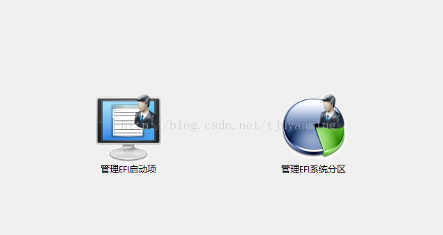
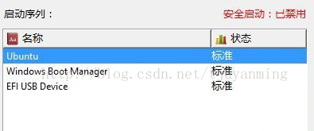
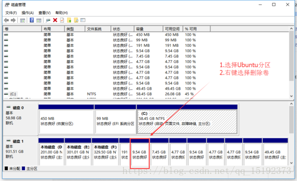

# 重装双系统中的Ubuntu
文章拼接转载自[Win10+Ubuntu双系统删除Ubuntu方法](https://www.cnblogs.com/pualus/p/7835422.html)、[UEFI启动Windows10+Ubuntu双系统删除Ubuntu方法](https://blog.csdn.net/tjuyanming/article/details/64929901)和[Win10+Ubuntu16.04双系统安装教程之2-重装Ubuntu16.04以解决grub2引导问题](https://blog.csdn.net/u010837794/article/details/72057958)。

## 一、删除引导文件
对于UEFI系统，可以傻瓜式删除引导文件。

### 1.下载EasyUEFI
下载链接：[点击下载](https://www.easyuefi.com/index-us.html)（EasyUEFI的企业版专门针对Windows10企业版用户，如果你是非企业版可以直接去官网下载EasyUEFI免费版。）

安装之后打开：

### 2.管理启动项
选择管理启动项，如果你符合上述情况，你会看到如下内容：

点击ubuntu 然后点击右边的删除的图标。重启电脑，你的电脑就是默认可以进入Windows10了，删除你的Linux所在分区就好。

## 二、删除旧ubuntu系统
### 1.磁盘管理
打开磁盘管理。

### 2.删除分区
 右键删除 Ubuntu 的所有分区(可能没有卷名，只能根据大小来区分)，如下图：
 

## 三、安装新Ubuntu系统
### 1.安装
根据装系统教程安装新系统。

### 2.注意事项
“步骤二”中c盘200m左右的分区可能无法删除，在安装中出现的分区设置中就可以进行删除。